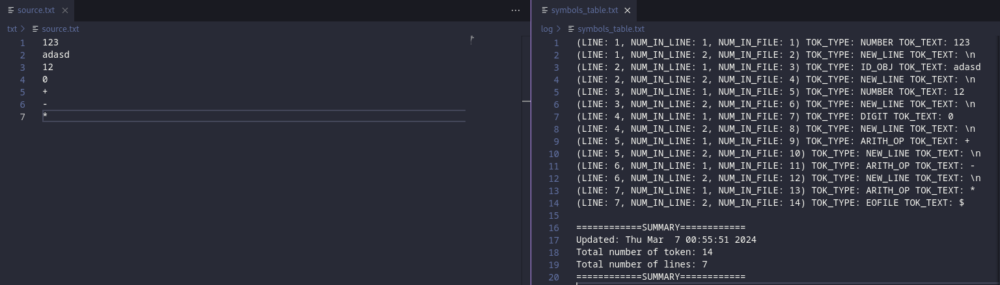

In general, it parses the `source.txt` and makes a lexical analysis of the source code written in Stasyan language. The output of the program is `symbol_table.txt`, where all tokens can be found. Moreover, it produces some additional debugging information and does error handling.

## What it can do?
The last version can identify:
* Arithmetical operators
* Type identifiers
* Object identifiers
* Digits
* Numbers (unsigned) 
* \n 
* EOF

## Dependencies
1. GNU Compiler Collection
2. Valgrind

## How to use it?
1. Git clone this repository using:
```bash 
cd $(working_repo)
git clone git@github.com:EtoAndruwa/Lexer.git 
```
2. Write the code of `source.txt` using some text editor (VS code, Sublime, etc):
```bash
code ./Lexer/txt/source.txt
```
3. Run Makefile in order to compile & run the whole project:
```bash
make
```
4. The output will be in the folder `./Lexer/log`


## History of updates:
* 06.03.24
* 04.03.24